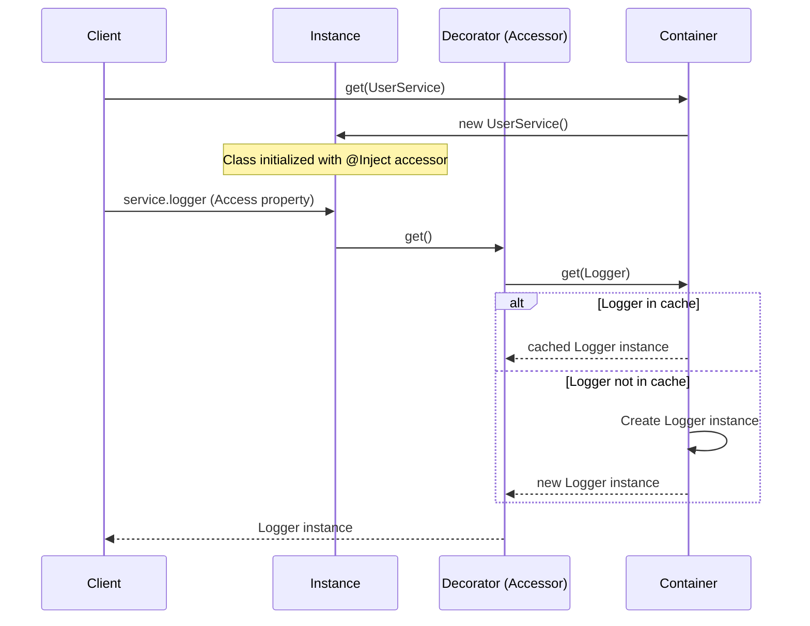

# di3

A simple & lightweight, type-safe dependency injection (DI) library, built on the ECMAScript Stage 3 decorators proposal.

## Features

- **Stage 3 Decorators**: Leverages native JavaScript/TypeScript class accessor decorators (no legacy `experimentalDecorators` or `emitDecoratorMetadata` required). Read more on the [TC39 Decorators Proposal](https://github.com/tc39/proposal-decorators).
- **Immutability & Safety**: Enforces read-only properties at runtime to prevent accidental reassignments and invalid default initializations.
- **Lazy Resolution**: Dependencies are resolved from the container only upon first property access.
- **Circular Dependency Support**: Handles circular references gracefully using factory providers.
- **Zero-Dependency & Tiny Footprint**: Extremely lightweight codebase with zero external runtime dependencies.

## Why this project?

Traditional DI libraries in the TypeScript ecosystem (such as InversifyJS or TypeDI) rely heavily on legacy experimental decorators (`experimentalDecorators` and `emitDecoratorMetadata`). These legacy decorators require compiler-specific hacks, generate verbose transpiled code, and rely on heavy metadata reflection APIs (`reflect-metadata`), which have not advanced to standard ECMAScript.

`di3` is designed for the modern JavaScript/TypeScript era. By utilizing **ECMAScript Stage 3 decorators** (specifically class accessors), `di3` achieves:

1. **Standards Compliance**: Runs natively on modern runtimes and bundlers without proprietary reflection libraries.
2. **Runtime Assurances**: Employs accessor `get`/`set`/`init` hooks to block mutability and enforce dependency boundaries at runtime, rather than relying solely on compile-time TypeScript annotations.

## Installation

Install `di3` using your preferred package manager:

```bash
# pnpm
pnpm add di3

# npm
npm install di3

# yarn
yarn add di3

# bun
bun add di3
```

## Requirements

- **Node.js**: `>= 18.0.0`
- **TypeScript**: `>= 5.0.0` (for Stage 3 decorator support)

## Quick Start

Below is a minimal working example showing how to declare, inject, and resolve dependencies.

```typescript
import { container, Inject } from 'di3';

// 1. Define a dependency
class Logger {
  log(message: string) {
    console.log(`[LOG]: ${message}`);
  }
}

// 2. Inject dependency using the @Inject decorator on an accessor
class UserService {
  @Inject(Logger)
  accessor logger!: Logger;

  greet(name: string) {
    this.logger.log(`Hello, ${name}!`);
  }
}

// 3. Resolve the entry point class from the container
const userService = container.get(UserService);
userService.greet('World'); // Logs: [LOG]: Hello, World!
```

## Core Concepts

`di3` centers around three primary architectural components:

1. **The Container**: A centralized registry that lazily resolves and caches singleton instances. When `container.get(token)` is invoked, it checks if an instance exists for the given token. If missing, it creates the instance (or runs the factory) and caches it.
2. **The `@Inject` Decorator**: Applied specifically to class `accessor` properties. Accessor decorators generate native getter and setter hooks.
   - **`get`**: Queries the container dynamically and caches the reference upon first access.
   - **`set`**: Intercepts reassignment and throws a runtime violation error to preserve immutability.
   - **`init`**: Restricts default value initialization on the accessor to prevent bypassing the DI container.
3. **Injection Tokens**: Identifiers used for dependency lookup. A token is either a class constructor or a factory provider.



## API

### `container`

The global singleton instance of the dependency injection `Container`.

#### `container.get<T>(token: InjectionToken<T>): T`

Resolves the injection token to its cached singleton instance.

- **Parameters**:
  - `token`: `InjectionToken<T>` — A class constructor or a factory provider object.
- **Returns**: `T` — The resolved singleton instance.
- **Throws**: An `Error` if the token is unsupported (neither a class constructor nor a factory provider object).

```typescript
const db = container.get(DatabaseConnection);
```

---

### `@Inject(token)`

A decorator used to inject dependencies into class accessor properties.

- **Parameters**:
  - `token`: `InjectionToken<T>` — The class constructor or factory provider to resolve.
- **Returns**: `ClassAccessorDecoratorResult` — The decorator descriptor targeting the accessor.
- **Throws**: An `Error` at runtime if applied to non-accessor properties (e.g. standard fields, methods), if the property is reassigned, or if it is initialized with a default value.

```typescript
class HttpController {
  @Inject(ApiService)
  accessor api!: ApiService;
}
```

---

### Types

#### `Constructor<T>`

Represents a class constructor function.

```typescript
type Constructor<T = any> = new (...args: any[]) => T;
```

#### `FactoryProvider<T>`

Defines a provider object that uses a custom factory function to resolve the dependency.

```typescript
type FactoryProvider<T = any> = {
  useFactory: () => T;
};
```

#### `InjectionToken<T>`

Union type of valid tokens accepted by the container.

```typescript
type InjectionToken<T = any> = Constructor<T> | FactoryProvider<T>;
```

---

### Utilities

#### `isClass(v: any): v is Constructor`

Identifies if a value is a class constructor, with support for transpiled ES5 classes and native ES6 classes.

#### `getClassName(instance: object): string`

Safely retrieves the class constructor name from an object instance.

## Examples

### Using Factory Providers

Factory providers are useful for injecting configured values or dynamic objects:

```typescript
import { container, Inject } from 'di3';

const ConfigProvider = {
  useFactory: () => ({
    baseUrl: process.env.API_BASE_URL || 'https://api.example.dev',
    timeout: 5000
  })
};

class Client {
  @Inject(ConfigProvider)
  accessor config!: { baseUrl: string; timeout: number };
}

const client = container.get(Client);
console.log(client.config.baseUrl);
```

### Lazy Circular Dependency Resolution

To prevent infinite loops with circular dependencies, break the instantiation cycle using lazy factory providers:

```typescript
import { container, Inject } from 'di3';

class ServiceA {
  @Inject({ useFactory: () => container.get(ServiceB) })
  accessor b!: ServiceB;
}

class ServiceB {
  @Inject({ useFactory: () => container.get(ServiceA) })
  accessor a!: ServiceA;
}

const a = container.get(ServiceA);
const b = container.get(ServiceB);

console.log(a.b === b); // true
console.log(b.a === a); // true
```

## Design Decisions

- **Why Accessors?**: Standard TypeScript/JavaScript fields decorated with Stage 3 decorators execute their decorator logic during class instantiation, but cannot easily intercept property access on the prototype without replacing the entire object layout. By enforcing class `accessor` properties, `di3` utilizes native getters/setters, allowing dependency lookup to remain fully lazy and preventing post-initialization mutations.
- **Strict Immutability**: Allowing injected properties to be mutated or initialized with defaults leads to fragile dependency states. The library throws runtime errors if reassignment (`set`) or custom initialization (`init`) is attempted on injected properties.
- **Global Registry**: To minimize configuration boilerplate, `di3` exports a single pre-configured `container` singleton. This avoids the overhead of manual container propagation across layers of code.

## TypeScript Support

`di3` requires TypeScript version `5.0` or higher to support ECMAScript Stage 3 decorators.

Ensure that `experimentalDecorators` is either **omitted or set to `false`** in your `tsconfig.json`, as standard decorators will not run correctly under the legacy decorator compiler flag:

```json
{
  "compilerOptions": {
    "target": "ES2022",
    "module": "NodeNext",
    "moduleResolution": "NodeNext",
    "experimentalDecorators": false
  }
}
```

Decorated properties must be declared using the `accessor` keyword and the definite assignment assertion operator (`!`):

```typescript
@Inject(MyService)
accessor service!: MyService;
```

## Best Practices

- **Use Class Constructors as Tokens**: Whenever possible, use class constructors directly as their own tokens. This eliminates the need to maintain separate token registries or string keys.
- **Always Declare as Definite Assignment**: Because properties are initialized lazily at runtime, use the `!` postfix operator to satisfy TypeScript compiler null/undefined checks.
- **Avoid Factory Side Effects**: Keep factory functions inside `useFactory` pure and side-effect free to avoid unexpected instantiation behavior.

## Limitations

- **Accessor Restriction**: `@Inject` can only decorate properties declared with the `accessor` keyword. Standard fields, methods, or parameters are intentionally left out.
- **Singleton Cache Only**: The container registers all resolved dependencies as singletons. There is no transient or request-scope support out of the box.
- **Single Global Container**: There is no built-in support for hierarchical container resolution or multiple isolated containers.

## FAQ

#### Why am I getting compilation errors when using `@Inject`?

Ensure your `tsconfig.json` targets `ES2022` or newer and that `experimentalDecorators` is disabled. Standard Stage 3 decorators require the `accessor` keyword before the property name.

#### Can I assign a default value to an injected property?

No. Initializing a property like `@Inject(Dep) accessor dep = new Dep()` throws a runtime error. Injected properties must be resolved entirely through the DI container.

## Contributing

1. Clone the repository.
2. Install dependencies:
   ```bash
   pnpm install
   ```
3. Run test suites to verify your changes:
   ```bash
   pnpm test
   ```
4. Verify code formatting and linting:
   ```bash
   pnpm lint
   pnpm format
   ```

## Testing

Tests are written using Vitest. To run all unit and integration tests:

```bash
pnpm test
```

## License

This project is licensed under the Apache License, Version 2.0. See the [LICENSE](./LICENSE) file for details.
